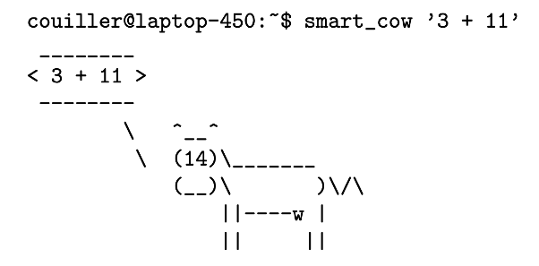
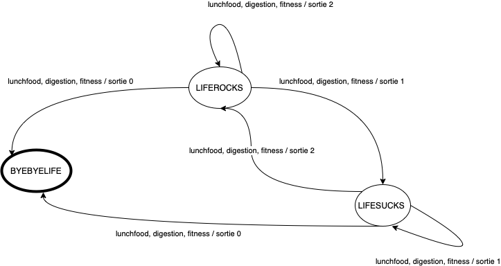

# Compte Rendu INF203

## Introduction

On the UE course of INF203 under the general idea of learning the basic commands of BASH and having an introduction at the C language programming, we are forced to develop two different projects using BASH (Shell scripting) for the first phase as well as C for the rest of the phases and following the different programming techniques as well as skills that we developed during this semester. Below are written the indications that we needed to follow, the procedure that we followed in order to resolve any problems, as well as a summary of the problems / difficulties that we met. Our goal through this project is to explore smart applications of functions in these two essential programming languages while we are staying focused on the indications given by the project’s paper.On the UE course of INF203 under the general idea of learning the basic commands of BASH and having an introduction at the C language programming, we are forced to develop two different projects using BASH (Shell scripting) for the first phase as well as C for the rest of the phases and following the different programming techniques as well as skills that we developed during this semester. Below are written the indications that we needed to follow, the procedure that we followed in order to resolve any problems, as well as a summary of the problems / difficulties that we met. Our goal through this project is to explore smart applications of functions in these two essential programming languages while we are staying focused on the indications given by the project’s paper.

## Indications

**Phase 1 (Bash)**

By using the cowsay library of Bash (to be installed) we need to propose several scripts that perform the following actions mentioned below. In the scripts below, the goal is to use dynamic listing of content, directed to cowsay printing function. We are required to create seven scripts. More specificallyBy using the cowsay library of Bash (to be installed) we need to propose several scripts that perform the following actions mentioned below. In the scripts below, the goal is to use dynamic listing of content, directed to cowsay printing function. We are required to create seven scripts. More specificall:

1. cow kindergarten
2. cow primaryschool
3. cow highschool
4. cow college
5. cow university
6. smart cow
7. crazy cow

*cow kindergarten*: Pronounces the numbers from 1 to 10.

*cow primaryschool*: Pronounces the numbers from 1 to a number
that is specified as argument from the user (ex: ./cow_primaryschool 15).

*cow highschool*: Pronounces the number from 1 all the suites of number until reaching the limit x with the condition to pronounce the x^2.

*cow college*: Pronounces the fibonanchi numbers until a limit set by the user (ex: ./cow_college 8).

*cow university*: Pronounces the suite of first numbers until a certain limit set by the user (ex: ./cow_university 6).

*smart cow:* By adding a mathematical expression (*,+,-,/) with only two terms, the program does the operation and gives an output like the following:



*crazy cow*: On the project is mentioned to leave our imagination free and create a script. We decided to create a feedback program for a website. The cow poses several questions to the user after he is automatically redirected on the website, saves the responses (0 to 5) and according to level of satisfaction, it may ask for further feedback. Last but not least, before it terminates the feedback survey, the program prints a dynamic message according to user’s overall review

**Phase 2 (C)**

The general idea was to code the simple functions of the
cowsay project that we used on the first Phase of this project. This phase is extending even further by implementing the design of an Automate in the workflow of small video game with the cow where the user needs to feed it according to cow's health. Before that, there are several tasks that need to be performed. More specifically:

1. Create a function that will print the cow onto the
   terminal
2. Add some more functionality on the cow by giving the ability to have modifiable eyes. In that case several tests need to be done.
3. Let our imagination to make something intresting. We
   decided to take inspiration from some ASCII art examples. So we designed a program which take as argument a number between 1 and 9 and then it counts down starting from the given time. Every second appears on the screen to corresponding second on the
   cown-down time with an ASCII representation. When the time is up, our cow appears that says "Coucou! Hello world!".
4. The idea to create an animated cow by using the given
   functions void update() and gotoxy(x,y).
5. The program needs to read from a file its content (the file's name is given as an aurgument) and the cow needs to print caracter par caracter the corresponding caracter on its mouth and then save it on the text's bubble above the cow.

## Procedure

As team, we decided to work to the corresponding workflow below:

* Organization, transparency and communication are our standards for a good team work.
* According to the mantra mentioned above, we used the softwares mentioned below:
  1. GitHub: Includes our private repository with all the code that has been submitted by the team members. It tracks the live versions that every team member is watching every time on his personal desktop workstation. Also, GitHub provides a great way to visualize any changes and to restore previous versions of the code.
  2. VSCode: Instead of the direct terminal idle, we decided to work on VSCode since it is a universal development app, with some great extensions to integrate onto the workflow and to visualize better the different commands. In addition to that, it offers a direct connection to our GitHub repository.
  3. W3Schools: Used for classes documentation that we integrated for part c on our separate version (explanation at paragraph Difficulties/Project – section 11).
* From the first view of the project, we knew that
  the phase C would be the most complicated one and there was a possibility that we couldn’t be able to make it so far. So, our goal was set to complete as better as possible the rest of the tasks.
* For every step on the different two phases
  mentioned above, we decided to follow the “exams technique”. This means, that we will follow the exact steps by including the required elements mentioned on the specific task (function, returned value, required arguments, etc.) as part of project’s understanding. The rest of the code will get completed according to the personal point of view through the understanding process of the task. This will allow us to have the biggest understanding that is possible, for this demanding project.
* The phase 1 as proposed needs to be completed before the final course of Bash (week before the vacations). We finalized the code for this phase after our return from the vacation.

**There was a merge of programs between the members that came and collaborated together. So, on our code section are included in several parts two versions of the code. The second version was produced with the mergion of the different programs from the team members and it is the most optimised.**

**This means that the whenever exist version 2 of a program, is the version that we were keeping updated and it's the one that we propose as program for the coresponding exercise.**

## Difficulties/Problems

In this section we are presenting the different challenges that we met and the workflows around them in order to be solved:

1. The first difficulty that we needed to solve was how the smart cow program will understand the expression that it needs to perform. To solve this issue we divided the cases that we will do with a filtration with the cut command. Firstly, we save the operator in a variable
   and then we compare the operator’s variable with the four math expressions.
2. Something that is interested is that during our TPs when we needed to do a multiplication we couldn’t do that by using

   ```
   $(expr 5 * 4)
   ```

   for instance. In order to go around this issue, for all the multiplications required to the phase 1, we used this syntax

   ```
   $(( 5 * 4 ))
   ```
3. When we had to test if a number was Premier on the cow_university exercise, we firstly introduced another function that would check this option but in the end we ended on integrating the code to the whole program instead.
4. On the smart_cow the multiplication function do not work always. There are times that it works and other times that it doesn't work. The systex of the given expression argument must be of type "3 + 10" for instance and not "3+10" or 3+10.
5. Another challenge was the appearance of the cow on the terminal screen (phrase 2). The given ASCII code was a great start but we had to do some modifications with the special caracters that are accepted on the printf command, as well as the fact that we needed to represent it in an one-line printing message by taking into consideration the spaces that were required.
6. In order to change the eyes caracters we had to pass though several tests. The first one was to check if the first parameter was the correct phrase that would activate the mechanism that will change the eye's characters. Since the argument is parsed via a pointer and we need to compare it with a string, after further examination, we decided to use an strcmpr. Then we are using a safe mechnism that checks if the argument that was parsed for the eye's caracters are specifically 2 caracters only. Last but not least, we modified the affiche_vache function so that it can receive the new caracters for the eyes.
7. In the imagination project, one challenge that we came
   across was the fact that we had to use a pointer to access the variabe that has stored the elements that we are comparing the inputed argument for the "-count" scenario, so that we can decode and receive an int that can be used in the for that we have created so that we can do the countdown. In teh enddd we decided to parse a seperate scanf to receive the user's input.
8. We coudn't understand how to use the gotoxy functions to
   animate the cow, so we created a sequence of differantiated appearance states of the cow and we added in order so that we can create the illusion that the cow opens and closes the eyes.
9. In different sections on the probelms/scenarios mentioned above, we found that we need to cler the screen and have full control of what we are printing on it. This is how the clear_screen function came to love:

   ```
   void clearScreen()
   {
     const char *CLEAR_SCREEN_ANSI = "\e[1;1H\e[2J";
     write(STDOUT_FILENO, CLEAR_SCREEN_ANSI, 12);
   }
   ```
10. We have observed that when we arew using this function, always on the upper left corner there is a constant caracter that is presented that maybe comes from the cached memory since it is not related to the code at all.
11. In order to make the cow to stock the said
    characters from the file we came in with the idea to create a list that is initially vide and to concantinate every character that is from our fscanf to this list (table actually). Then we are combining every character in order to create the whole string that replace the message on the text's bubble.
12. Designing the automate was one of the most challenging parts
    not because of its difficulty, but because we couldn't understand the connection between the different variables and what we will have as an output of every state's change. After having started by designing the automate with basic states the number of available stockage, this lead us to a huge list of subcategories and exceptions, but at the same time we understood what was expected to do on the same place. This is how we understood the video game's logic and we arrived on the following automate:
    
13. We need to mention that the operation that creates random numbers needed some further research so we findexactly how it selects the random numbers. So we arrived at the following form:

    ```
    rand()%(end+1-start)+start;
    ```
14. On our automate's program we used a hybrid model
    of the systax. Instead of using a pointer to change the local variable that we initialised like the fitness and stock variables, we are redefining them with a call to the respective functions and by saving the result of the variable with the same name. We could definitely write it with pointers but it was more visible to us for how we are going to treat the different cases and for how to find out when there is a game over or an end of the game to a parameter.

## Code

### cow_kindergarten

#### Version 1

```
numbers="1 2 3 4 5 6 7 8 9 10"
var=""
clear
for var in $numbers
do
    cowsay $var
    sleep 1
    clear
done
```

#### Version 2

```
#!/bin/bash 

i=10
while [ $i -ne 1 ] 
do 
    cowsay $i
    ((i--))
    sleep 1
    clear
done 
cowsay -T \U  1
```

### cow_primaryschool

#### Version 1

```
#!/bin/sh

a=1
clear
while [ $a -le $1 ]
do
   cowsay $a 
   sleep 1
   clear
   a=`expr $a + 1`
done
```

#### Version 2

```
#!/bin/bash 

i=$1
while [ $i -ne 1 ] 
do 
    cowsay $i
    ((i--))
    sleep 1
    clear
done 
cowsay -T \U 1
```

### cow_highschool

#### Version 1

```
#!/bin/sh

a=1
clear
while [ $a -le $1 ]
do
   lamda=$(( $a * $a ))
   cowsay $lamda
   sleep 1
   clear
   a=`expr $a + 1`
done
```

#### Version 2

```
#!/bin/bash 

i=$1
while [ $i -ne 1 ] 
do 
    n=$(($i * $i))
    cowsay $n
    ((i--))
done 
cowsay -T \U 1
```

### cow_college

#### Version 1

```
clear
n1=0
n2=1
if [ $1 -lt 0 ]
then
    cowsay "incorrect input"
    sleep 3
    clear
elif [ $1 -eq 1 -o $1 -eq 2 ]
then
    cowsay $n2
    sleep 1
    clear
elif [ $1 -eq 0 ]
then
    echo Fibonnaci number is 0
    sleep 3
    clear
else
    nht=$(( $n1 + $n2 ))
    cowsay $nht
    sleep 1
    clear
    while [ $nht -lt $1 ]
    do
        n1=$n2
        n2=$nht
        nht=$(( $n1 + $n2 ))
        cowsay $nht
        sleep 1
        clear
    done
fi
```

#### Version 2

```
#!/bin/bash 

n=$1
a=0
b=1
for ((i=0; i<n; i++))
do
        fn=$(($a + $b))
        a=$b
        b=$fn
        cowsay $fn
done
 fn=$(($a + $b))
    a=$b
    b=$fn
    cowsay -T \U $fn
```

### cow_university

#### Version 1

```
#!/bin/bash 

n=$1

for ((i=2;i<n; i++))
do 
    mod=$(expr $n%$i)
    if [ $mod -ne 0 ]
    then 
        cowsay $i
    fi
done
```

#### Version 2

```
#!/bin/sh

if [ $1 -gt 0 ]
then
    num=$1
    for i in $1
    do
        limnos=2
        karpa=$(( $num % $i ))
        while [ $limnos < $num -a $karpa -ne 0 ]
        do
            limnos=$(( $limnos + 1 ))
            karpa=$(( $1 % $limnos ))
        done
        if [ $limnos -eq $num ]
        then
            lamda=0
        else
            lamda=1
        fi

        if [ $lamda -eq 0 ]
        then
            cowsay $num
        fi
        num=$num-1
    done
else
    echo We need a positive number
    echo Operation terminated
fi
```

### smart_cow

#### Version 1

```
#!/bin/bash 

a=$1 
b=$2 
mtp=$(expr $a \* $b)
cowsay -e $mtp $a*$b 
```

#### Version 2

```
#!/bin/bash

kappa=$(echo $1 | cut -d" " -f 2)
if [ "$kappa" == "+" ]
then
    echo +
    n1=$(echo $1 | cut -d+ -f 1)
    n2=$(echo $1 | cut -d+ -f 2)
    lamda=$(expr $n1 + $n2)
    cowsay -e $lamda $1
elif [ "$kappa" == "-" ]
then
    echo -
    n1=$(echo $1 | cut -d- -f 1)
    n2=$(echo $1 | cut -d- -f 2)
    lamda=$(expr $n1 - $n2)
    cowsay -e $lamda $1
elif [ "$kappa" == "/" ]
then
    echo /
    n1=$(echo $1 | cut -d/ -f 1)
    n2=$(echo $1 | cut -d/ -f 2)
    lamda=$(expr $n1 / $n2)
    cowsay -e $lamda $1
else
    n1=$(echo $1 | cut -d" " -f 1)
    n2=$(echo $1 | cut -d" " -f 3)
    echo $n1
    echo $n2
    lamda=$(expr $a \* $b)
    cowsay -e $lamda $1
fi
```

### crazy_cow

```
#!/bin/bash

clear
echo Before we start, which is your name ?
read name
clear
echo Welcome to the online feedback portal by Lekitable $name !
sleep 1
cowsay "I am Marlyn, your personal assistant"
sleep 2
clear
echo Welcome to the online feedback portal by Lekitable $name !
cowsay "We will start from our latest website version feedback"
sleep 3
echo Welcome to the online feedback portal by Lekitable $name !
clear
cowsay "Whenever you are ready to start, reply below"
echo "Yes or No ?"
read response

if [ "$response" == "Yes" ]
then
  cowsay Let\'s begin $name
  
  count=0
  total=34
  pstr="[=======================================================================]"
  while [ $count -lt $total ]; 
  do
    sleep 0.25 # this is work
    count=$(( $count + 1 ))
    pd=$(( $count * 73 / $total ))
    printf "\r%3d.%1d%% %.${pd}s" $(( $count * 100 / $total )) $(( ($count * 1000 / $total) % 10 )) $pstr
  done
  clear

  cowsay Great!
  sleep 2

  seconds=4

  clear
  while [ $seconds -ne 0 ]
  do
    seconds=$(( $seconds - 1 ))
    cowsay "You will get redirected onto the website https://lekitable.fr in $seconds"
    sleep 1
    clear
    count=0
    total=20
    pstr="[=======================================================================]"
  done
  
  while [ $count -lt $total ]; 
  do
    sleep 0.1 # this is work
    count=$(( $count + 1 ))
    pd=$(( $count * 73 / $total ))
    printf "\r%3d.%1d%% %.${pd}s" $(( $count * 100 / $total )) $(( ($count * 1000 / $total) % 10 )) $pstr
  done

  open https://lekitable.fr

  cowsay Expore the website and come back later when you are ready to share your point of view
  echo "When you are ready just click \"Enter\""

  read kati
  count=0
  total=15
  pstr="[=======================================================================]"
  
  while [ $count -lt $total ]; 
  do
    sleep 0.1 # this is work
    count=$(( $count + 1 ))
    pd=$(( $count * 73 / $total ))
    printf "\r%3d.%1d%% %.${pd}s" $(( $count * 100 / $total )) $(( ($count * 1000 / $total) % 10 )) $pstr
  done

  echo Success!
  sleep 1
  clear

  #Question 1
  cowsay Question no 1
  sleep 2
  cowsay "How would you rate your experience?"
  echo "Please reply with a number from 1 (not good) to 5 (very good)"
  read exp1

  if [ $exp1 -lt 3 ]
  then
    clear
    cowsay "We are sad to hear that. Whould you like to specify why you rated us with $exp1 for your overal experience on the site?"
    echo Reply with YES or No
    read rep1

    if [ $rep1 == "YES" ]
    then
      clear 
      cowsay "Please specify below..."
      read resp1
    fi
  fi
  sleep 1
  clear

  #Question 2
  cowsay Question no 2
  sleep 2
  cowsay "How likely are you to recommend our website to a friend?"
  echo "Please reply with a number from 1 (not good) to 5 (very good)"
  read exp2

  if [ $exp2 -le 2 ]
  then
    clear
    cowsay "Hmm It seems that you wouldn't recomend this site to a friend. Why is that?"
    echo "Please specify below..."
    read resp1
  else
    clear
    cowsay "Thank you for your score. Is there anything missing on this page?"
    echo Reply with YES or No
    read rep2
    if [ $rep2 == "YES" ]
    then
      clear 
      cowsay "Please specify below..."
      read resp2
    fi
  fi
  clear
  cowsay "Thank you very much for your time $name! Have a nice day."

else
  echo "Ok, bye!"
fi
```

### affiche_vache

```
#include <stdio.h>

void affiche_vache(){
    printf("\\  ^__^\n \\ (00)\\_______\n   (__)\\       )\\/\\\n       ||----w |\n       ||     ||\n");
}
```

### newcow

```
#include <stdio.h>
#include <string.h>

void affiche_vache(){
    printf("\\  ^__^\n \\ (00)\\_______\n   (__)\\       )\\/\\\n       ||----w |\n       ||     ||\n");
}

int main(int argc, char *argv[]){
    int k;
    k = argc;
    if (k-1 == 2) {
        if (!strcmp(argv[1],"-e")){
            int i,totChar;
            totChar = 0;
            for(i=0; argv[2][i] != '\0'; i++){
                totChar++;
            }
            if (totChar==2){
                printf("\\  ^__^\n \\ (%s)\\_______\n   (__)\\       )\\/\\\n       ||----w |\n       ||     ||\n",argv[2]);
            }
            else {
                affiche_vache();
            }
        }
        else {
            printf("No argument given for the eyes\n");
        }
    }
    else {
        affiche_vache();
    }
}
```

### newcow-imagination

To access the imagination action, please use the argument -count and then you will be asked for a number. Follow th einstructions on screen. On the program is also integrated the option for the eyes argument.

```
#include <stdio.h>
#include <string.h>
#include <stdlib.h>
#include <unistd.h>

void affiche_vache_simple(){
    printf("   ^__^\n   (00)\\_______\n   (__)\\       )\\/\\\n       ||----w |\n       ||     ||\n");
}

void affiche_vache_eyes(char text[]){
    printf("   ^__^\n   (%s)\\_______\n   (__)\\       )\\/\\\n       ||----w |\n       ||     ||\n", text);
}

void affiche_vache(char text[]){
    printf("< %s >\n\\  ^__^\n \\ (00)\\_______\n   (__)\\       )\\/\\\n       ||----w |\n       ||     ||\n", text);
}

void clearScreen()
{
  const char *CLEAR_SCREEN_ANSI = "\e[1;1H\e[2J";
  write(STDOUT_FILENO, CLEAR_SCREEN_ANSI, 12);
}

void one(int o){
    if (o==1){
    printf("1111\n  11\n  11\n  11\n111111\n");
    }
    else if (o==2) {
    printf(" 2222 \n22  22\n   22 \n  22  \n222222\n");
    }
    else if (o==3) {
        printf(" 3333 \n33  33\n   333\n33  33\n 3333 \n");
    }
    else if (o==4) {
        printf("44  44\n44  44\n444444\n    44\n    44\n");
    }
    else if (o==5) {
        printf("555555\n55    \n55555 \n    55\n55555 \n");
    }
    else if (o==6) {
        printf(" 6666 \n66    \n66666\n66  66\n 6666 \n");
    }
    else if (o==7) {
        printf("777777\n   77 \n  77  \n 77   \n77    \n");
    }
    else if (o==8) {
        printf(" 8888 \n88  88\n 8888 \n88  88\n 8888 \n");
    }
    else if (o==9) {
        printf(" 9999 \n99  99\n 99999\n    99\n 9999 \n");
    }
    else if (o==0) {
        printf(" 0000 \n00  00\n00  00\n00  00\n 0000 \n");
    }
}


int main(int argc, char *argv[]){
    char code[19]="0 1 2 3 4 5 6 7 8 9";
    int i,k,j;
    k = argc;
    if (k-1 == 2) {
       if (!strcmp(argv[1],"-e")){
            int i,totChar;
            totChar = 0;
            for(i=0; argv[2][i] != '\0'; i++){
                totChar++;
            }
            if (totChar==2){
                affiche_vache_eyes(argv[2]);
            }
            else {
                affiche_vache_simple();
            }
        }
    }
    else {
        if (!strcmp(argv[1],"-count")) {
            printf("Donner un nombre entre 0 et 9\n");
            scanf("%d", &k);
            clearScreen();
            for (j=k; j>=0;) {
                one(j);
                sleep(1);
                clearScreen();
                j--;
            }
            affiche_vache("Coucou! Hello world");
        }
        else {
            affiche_vache(argv[1]);
        }
    }
}
```

### affiche_vache-animated

After the program is compilled, it requires a number as argument during execution.

```
#include <stdio.h>
#include <string.h>
#include <unistd.h>
#include <stdio.h>

void update () { printf ("\033[H\033[J");}
void gotoxy (x ,y) { printf (" \033[%d;%dH",x , y) ;}

void affiche_vache(int i){
    gotoxy(i+1,i+15);
    printf( "\\ ^__ ^\n");
    gotoxy(i+1,i+15);
    printf("\\  (00) \\ _______ \n");
    gotoxy(i+2,i+15);
    printf("   (__) \\         ) \\/\\\n");
    gotoxy(i+3,i+15);
    printf("       || - - - -w |\n");
    gotoxy(i+4,i+15);
    printf("       ||         ||\n" );
}

void affiche_fruit(int i){
    gotoxy(i,i);
    printf(" ,--./,-.\n");
    gotoxy(i+1,i);
    printf("/ #      \\\n");
    gotoxy(i+2,i);
    printf("|        |\n");
    gotoxy(i+3,i);
    printf("\\        / \n");
    gotoxy(i+4,i);
    printf(" `._,._,'\n");
    }

    void affiche_fruit_manger(int i){
        gotoxy(i,i);
        printf(" ,--./,-.\n");
        gotoxy(i+1,i);
        printf("/,-._.--~\\\n");
        gotoxy(i+2,i);
        printf(" __}  {\n");
        gotoxy(i+3,i);
        printf("\\`-._,-`-,\n");
        gotoxy(i+4,i);
        printf("`._,._,'\n");
    }

void cow(char *arg_e, char *arg_T, char *espace){
    printf("%s^__^ \n\
%s(%s)\\ _______ \n\
%s(__)\\         )\\/\\\n\
%s %s  ||------w |\n\
%s    ||       ||\n",espace, espace, arg_e, espace, espace, arg_T, espace);
}
 
void cow2(char *arg_e, char *arg_T, char *espace){
    printf("%s^__^ \n\
%s(%s)\\ _______ \n\
%s(__)\\         )\\/\\\n\
%s %s  /|------w |\n\
%s    \\|       \\|\n",espace, espace, arg_e, espace, espace, arg_T, espace);
}

void cow3(char *arg_e, char *arg_T, char *espace){
 printf("%s^__^ \n\
%s(%s)\\ _______ \n\
%s(  )\\         )\\/\\\n\
%s U  ||------w |\n\
%s %s  ||       ||\n",espace, espace, arg_e, espace, espace, arg_T, espace);
}


 
int main(int argc, char *argv[]){
    int coord; 
    sscanf(argv[1], "%d", &coord);
    long pos_e = -1;
    long pos_T = -1;
 
    char eye[10] = "oo";
    char eye2[10] ="00";
    char tongue[200] = " ";
  
 
    for (int i = 1; i < argc; i++){
        if (strcmp(argv[i],"-e") == 0){
            pos_e = i + 1;
            strcpy(eye, argv[pos_e]);
        }
        else if (strcmp(argv[i], "-T") == 0){
            pos_T = i + 1;
            strcpy(tongue, argv[pos_T]);
        }
    }
    char espace[20000] = "                                                    ";
  
    for (int k = 0; k <= 2; k++){
        if (k == 0){
        update();
        affiche_fruit(coord);
        sleep(1);
        cow(eye, tongue, espace);
        sleep(1);
        update();
        affiche_fruit(coord);
        cow2(eye2, tongue, espace);
        sleep(1);}

        else if(k==2){
            update();
            affiche_fruit(coord);
            cow3(eye2, tongue, espace);
            sleep(2);
            update();
            affiche_fruit_manger(coord);
            cow(eye2, tongue, espace);
            sleep(2);
            update();
            affiche_fruit_manger(coord);
            cow(eye, tongue, espace);
        }
        else{
            update();
            affiche_fruit(coord);
            cow(eye2, tongue, espace);
            sleep(1);
            update();
            affiche_fruit(coord);
            cow2(eye2, tongue, espace);
            sleep(1);
            update();
            affiche_fruit(coord);
            cow(eye2, tongue, espace);
            sleep(2);
        }
        for (int j = 0; j < strlen(espace); j++)
            strcpy(&espace[j], &espace[j+1]);
    }
}
```

*NOTE*: The terminal may give this error "illegal hardware instruction" to MacOS computers due to an architecture uncompability since MacOS uses its own built C library while Ubunutu and Windows computers take the ressources from the C Foundation.

### reading_cow

You can use the fichier.auto that is included with the project's zip file.

```
#include <stdio.h>
#include <string.h>
#include <unistd.h>

void affiche_vache(char text[]){
    printf("< %s >\n\\  ^__^\n \\ (00)\\_______\n   (__)\\       )\\/\\\n       ||----w |\n       ||     ||\n", text);
}

void affiche_vache_bouche(char text2[], char text){
    printf("< %s >\n\\  ^__^\n \\ (00)\\_______\n   (__)\\       )\\/\\\n    %c  ||----w |\n       ||     ||\n", text2, text);
}

void clearScreen()
{
  const char *CLEAR_SCREEN_ANSI = "\e[1;1H\e[2J";
  write(STDOUT_FILENO, CLEAR_SCREEN_ANSI, 12);
}

int main(int argc, char *argv[]){
    FILE *f; 
    char c;
    char tab[256];
    f = fopen(argv[1], "r"); if (f == NULL) {
        perror(argv[1]);
    }
    int j=0;
    fscanf(f, "%c", &c);
    while (!feof(f)) {
        tab[j]=c;
        j++;
        fscanf(f, "%c", &c); 
    }
    int i;
    char tab2[256];

    for (i=0; tab[i]!='\0';i++){
        affiche_vache_bouche(tab2, tab[i]);
        sleep(1);
        clearScreen();
        tab2[i]=tab[i];
        affiche_vache(tab2);
        sleep(1);
        clearScreen();
    }
    affiche_vache(tab2);
    printf("\n");
  
    return 0;
}
```

### automate

```
#include <stdio.h>
#include <string.h>
#include <stdlib.h>
#include <unistd.h>
#include<time.h>

#define LIFEROCKS 2
#define LIFESUCKS 1
#define BYEBYELIFE 0

void clearScreen()
{
  const char *CLEAR_SCREEN_ANSI = "\e[1;1H\e[2J";
  write(STDOUT_FILENO, CLEAR_SCREEN_ANSI, 12);
}

void affiche_vache(int i){
    //pour byebyelife
    if (i==0) {
        printf("< En train de byebyelife >\n\\  ^__^\n \\ (XX)\\_______\n   (__)\\       )\\/\\\n       ||----w |\n       ||     ||\n");
    }
    //pour liferocks
    else if (i==2) {
        printf("< Yeah! Liferocks >\n\\  ^__^\n \\ (00)\\_______\n   (__)\\       )\\/\\\n       ||----w |\n       ||     ||\n");
    }
    //pour lifesucks
    else if (i==1) {
        printf("< Oopss, lifesucks :( >\n\\  ^__^\n \\ (--)\\_______\n   (__)\\       )\\/\\\n       ||----w |\n       ||     ||\n");
    }
    else if (i==-1) {
        printf("Game over");
    }
}

int stock_update (int stock, int lunchfood, int crop) {
    if (lunchfood <= stock) {
        return (stock-lunchfood+crop);
    }
    else {
        return -1;
    }
}

int fitness_update(int fitness, int lunchfood, int digestion) {
    return (lunchfood+fitness+digestion);
}

int sortie(int etatcourant, int fitness, int lunchfood, int digestion) {
    switch (etatcourant) {
        case LIFEROCKS:
        if (0<=fitness_update(fitness, lunchfood, digestion) && fitness_update(fitness, lunchfood, digestion)<=10){
            if (fitness_update(fitness, lunchfood, digestion)==0 || fitness_update(fitness, lunchfood, digestion)==10) {
                return BYEBYELIFE;
            }
            else if (1<=fitness_update(fitness, lunchfood, digestion) && fitness_update(fitness, lunchfood, digestion)<=3) {
                return LIFESUCKS;
            }
            else if (7<=fitness_update(fitness, lunchfood, digestion) && fitness_update(fitness, lunchfood, digestion)<=9) {
                return LIFESUCKS;
            }
            else {
                return LIFEROCKS;
            }
        }
        else {
            return -1;
        }
        case BYEBYELIFE:
        if (0<=fitness_update(fitness, lunchfood, digestion) && fitness_update(fitness, lunchfood, digestion)<=10){
            if (1<=fitness_update(fitness, lunchfood, digestion) && fitness_update(fitness, lunchfood, digestion)<=3) {
                return LIFESUCKS;
            }
            else if (7<=fitness_update(fitness, lunchfood, digestion) && fitness_update(fitness, lunchfood, digestion)<=9) {
                return LIFESUCKS;
            }
            else if (4<=fitness_update(fitness, lunchfood, digestion) && fitness_update(fitness, lunchfood, digestion)<=6) {
                return LIFEROCKS;
            }
            else BYEBYELIFE;
        }
        else {
            return -1;
        }
        case LIFESUCKS:
        if (0<=fitness_update(fitness, lunchfood, digestion) && fitness_update(fitness, lunchfood, digestion)<=10){
            if (fitness_update(fitness, lunchfood, digestion)==0 || fitness_update(fitness, lunchfood, digestion)==10) {
                return BYEBYELIFE;
            }
            else if (4<=fitness_update(fitness, lunchfood, digestion) && fitness_update(fitness, lunchfood, digestion)<=6) {
                return LIFEROCKS;
            }
            else LIFESUCKS;
        }
        else {
            return -1;
        }
    }
    return -1;
}

int main(){
    int stock=5;
    int fitness=5;
    int etatcourant=LIFEROCKS;
    int start=-3;
    int end=3;
    int start_2=-3;
    int end_2=0;
    int digestion;
    int crop;
    int lunchfood;
    int duree_de_vie=0;
    clearScreen();
    affiche_vache(etatcourant);
    while (stock>=0 && stock<=10) {
        printf("Stock: %d\n", stock);
        printf("De combien voulez-vous alimenter la vache? (valeur entre 0 et %d)\n",stock);
        scanf("%d", &lunchfood);
   
        digestion = rand()%(end_2+1-start_2)+start_2;
        crop = rand()%(end+1-start)+start;

        etatcourant=sortie(etatcourant,fitness, lunchfood, digestion);
        affiche_vache(etatcourant);
        if (etatcourant==0){
            printf("La vache est mort :(\n");
            break;
        }
        else if (etatcourant==-1){
            printf("Game over. Le niveau de fitness n'est pas entre les limites definis\n");
            break;
        }
        fitness=fitness_update(fitness,lunchfood,digestion);
        stock=stock_update(stock,lunchfood,crop);
        if (stock<=0){
            printf("Le stock est vide.\n");
            break;
        }
        else if (stock>=10) {
            stock=10;
        }
        duree_de_vie++;
    }
    printf("La vache etait en vie pour %d jours\n", duree_de_vie);
}
```

---

Copyright 2022 | All right reserved - Vasileios Skarleas, Nada Yassine, Bernice Toko Kamga
